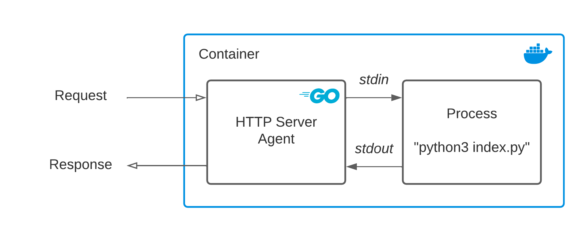

## agent 🍚

[](https://goreportcard.com/report/github.com/benhid/go-agent)
[](LICENSE)

A tiny web-server (reverse proxy) to run functions for every incoming HTTP request.



## Get started

### Build

To build the agent:

```bash
docker build -t benhid/go-agent .
```

Every container needs to embed this binary and use it as `CMD`, e.g.:

```Dockerfile
FROM benhid/go-agent as build-agent

# ...

COPY --from=build-agent /build/agent .

ENV fprocess="python3 index.py"

EXPOSE 80

CMD [ "./agent" ]
```

### Run

You can find a template of a Python application [here](python3/Dockerfile). Build with:

```bash
cd python3
docker build -t hello-python .
```

And run:

```bash
docker run -p 8090:80 hello-python
```

### Usage

```bash 
curl http://0.0.0.0:8090/ -d "hello world"
```
